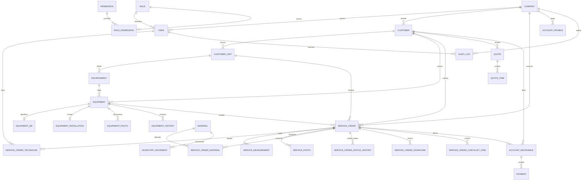

# DER Solucenter V1

```mermaid
erDiagram
 COMPANY ||--o{ USER : possui
 ROLE ||--o{ USER : classifica
 ROLE ||--o{ ROLE_PERMISSION : possui
 PERMISSION ||--o{ ROLE_PERMISSION : concede
 COMPANY ||--o{ CUSTOMER : atende
 CUSTOMER ||--o{ CUSTOMER_UNIT : possui
 CUSTOMER_UNIT ||--o{ ENVIRONMENT : divide
 ENVIRONMENT ||--o{ EQUIPMENT : aloja
 CUSTOMER ||--o{ EQUIPMENT : possui
 EQUIPMENT ||--o| EQUIPMENT_QR : identifica
 EQUIPMENT ||--o| EQUIPMENT_INSTALLATION : instala
 EQUIPMENT ||--o{ EQUIPMENT_PHOTO : documenta
 EQUIPMENT ||--o{ EQUIPMENT_HISTORY : historico
 COMPANY ||--o{ SERVICE_ORDER : executa
 CUSTOMER ||--o{ SERVICE_ORDER : solicita
 CUSTOMER_UNIT ||--o{ SERVICE_ORDER : localiza
 EQUIPMENT ||--o{ SERVICE_ORDER : recebe
 USER ||--o{ SERVICE_ORDER_TECHNICIAN : atua
 SERVICE_ORDER ||--o{ SERVICE_ORDER_TECHNICIAN : equipe
 SERVICE_ORDER ||--o{ SERVICE_MEASUREMENT : mede
 SERVICE_ORDER ||--o{ SERVICE_PHOTO : fotografa
 SERVICE_ORDER ||--o{ SERVICE_ORDER_MATERIAL : consome
 MATERIAL ||--o{ SERVICE_ORDER_MATERIAL : utilizado
 MATERIAL ||--o{ INVENTORY_MOVEMENT : movimenta
 SERVICE_ORDER ||--o{ SERVICE_ORDER_STATUS_HISTORY : audita_status
 SERVICE_ORDER ||--o{ SERVICE_ORDER_SIGNATURE : assina
 SERVICE_ORDER ||--o{ SERVICE_ORDER_CHECKLIST_ITEM : verifica
 CUSTOMER ||--o{ QUOTE : recebe
 QUOTE ||--o{ QUOTE_ITEM : contem
 CUSTOMER ||--o{ ACCOUNT_RECEIVABLE : deve
 SERVICE_ORDER ||--o{ ACCOUNT_RECEIVABLE : fatura
 ACCOUNT_RECEIVABLE ||--o{ PAYMENT : recebe
 COMPANY ||--o{ ACCOUNT_PAYABLE : paga
 COMPANY ||--o{ AUDIT_LOG : audita
 USER ||--o{ AUDIT_LOG : executa
```
